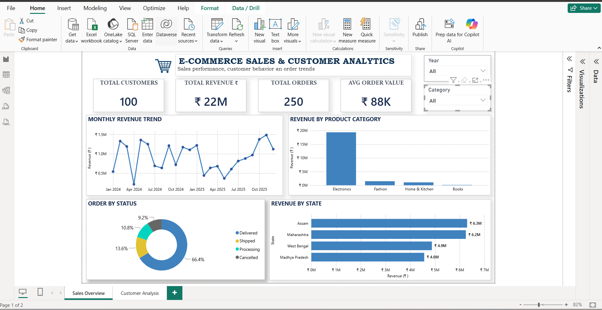
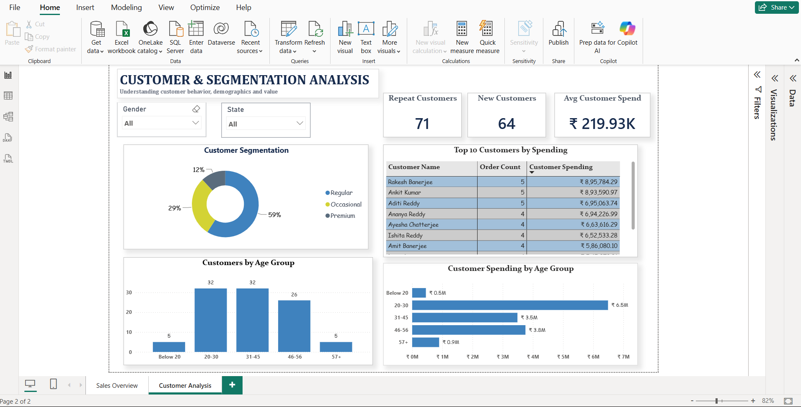

# E-Commerce Sales & Customer Analytics

## Project Overview

This project presents an end-to-end analysis of an e-commerce dataset using **MySQL** and **Power BI**. The objective was to analyze sales performance, customer behavior, product performance, order trends, and key business metrics, and then transform the findings into an interactive business dashboard.

SQL was used for business analysis, customer and product analysis, time-series analysis, and validation. Power BI was used for data modeling, DAX calculations, KPI monitoring, customer segmentation, and interactive data visualization.

---

## Business Objectives

The analysis was designed to answer questions such as:

- What are the overall revenue, order volume, customer count, and average order value?
- How does revenue change over time?
- Which product categories generate the most revenue?
- Who are the highest-value customers?
- How are customers distributed across demographic and behavioral segments?
- Which age groups contribute the most customer spending?
- What are the major order and payment patterns?
- Which products and customers rank highest based on sales and spending?

---

## Tools & Technologies

- **MySQL** — Data querying and business analysis
- **Power BI** — Data modeling and dashboard development
- **Power Query** — Data preparation and transformation
- **DAX** — KPI calculations, customer measures, and segmentation
- **GitHub** — Project documentation and portfolio presentation

---

## Dataset Structure

The relational e-commerce dataset contains five main tables:

| Table | Purpose |
| --- | --- |
| `customers` | Customer demographics and signup information |
| `products` | Product, category, subcategory, and price information |
| `orders` | Order dates, customer references, status, and shipping details |
| `order_items` | Products, quantities, and unit prices for each order |
| `payments` | Payment method, payment status, date, and amount |

A dedicated date dimension was also created in Power BI to support chronological analysis.

---

## Data Model

The Power BI model uses relationships between the main transactional and dimension-style tables:

- Customers → Orders
- Orders → Order Items
- Products → Order Items
- Orders → Payments
- DimDate → Orders

This structure supports analysis across customers, products, orders, revenue, and time.

---

## Key KPIs

| KPI | Result |
| --- | ---: |
| Total Revenue | **₹21.99M** |
| Total Orders | **250** |
| Total Customers | **100** |
| Average Order Value | **₹87.97K** |

---

## SQL Analysis

The SQL analysis contains **30 business-focused queries** covering basic, intermediate, and advanced SQL concepts.

Key techniques demonstrated include:

- `JOIN` and `LEFT JOIN`
- `GROUP BY` and `HAVING`
- Aggregate functions
- `CASE` statements
- Subqueries
- Common Table Expressions (CTEs)
- `RANK()` and `PARTITION BY`
- `LAG()`
- Window functions
- Cumulative calculations
- Month-over-month analysis

Examples of business analyses performed include:

- Top 10 customers by spending
- Revenue by product category
- Best-selling products
- Customers with no orders
- Customers spending above average
- Highest-revenue product within each category
- Top products per category
- Revenue by shipping state
- Cancellation percentage
- Revenue by payment method
- Monthly revenue trend
- Month-over-month revenue growth
- Cumulative revenue

The complete SQL analysis is available in:

`SQL/Ecommerce_SQL_Analysis.sql`

---

## Power BI Dashboard

### Page 1 — Sales Overview

The Sales Overview page provides a high-level view of business performance, including:

- Total Revenue
- Total Orders
- Total Customers
- Average Order Value
- Monthly Revenue Trend
- Revenue by Product Category
- Orders by Status
- Revenue by State
- Interactive filters



### Page 2 — Customer & Segmentation Analysis

The Customer Analysis page focuses on customer behavior and value, including:

- Repeat Customers
- New Customers
- Average Customer Spend
- Customer Segmentation
- Top 10 Customers by Spending
- Customers by Age Group
- Customer Spending by Age Group
- Gender and State filters



---

## Customer Segmentation

Customers were grouped based on their number of orders:

| Segment | Definition |
| --- | --- |
| Premium | 5 or more orders |
| Regular | 2–4 orders |
| Occasional | 1 order |

The dashboard shows that **Regular customers form the largest customer segment**, followed by Occasional and Premium customers.

---

## Key Insights

- **Electronics dominates revenue**, generating approximately ₹19.36M and accounting for the majority of total sales.
- Total revenue across the dataset is approximately **₹21.99M** from **250 orders**.
- The average order value is approximately **₹87.97K**.
- **Rakesh Banerjee** is the highest-spending customer at approximately **₹8.96L**, closely followed by Ankit Kumar.
- The **20–30 and 31–45 age groups each contain 32 customers**, but the 20–30 segment generates substantially higher customer spending.
- Customer order frequency does not always correspond directly to customer value; some customers with fewer orders generate higher spending than customers with more orders.
- Monthly revenue fluctuates considerably across the analysis period, highlighting the importance of time-based performance monitoring.

---

## Data Validation

Key Power BI calculations were cross-checked against MySQL query results to ensure consistency between the database and dashboard.

Validated metrics and analyses include:

- Total Revenue
- Total Orders
- Total Customers
- Average Order Value
- Top 10 Customers by Spending
- Revenue by Product Category
- Monthly Revenue Trend

For example:

- SQL Total Revenue: **₹21,993,308.30**
- Power BI display: **₹22M**
- SQL Average Order Value: **₹87,973.23**
- Power BI display: **₹88K**

The differences shown in the dashboard are due only to display-unit rounding.

---

## Skills Demonstrated

This project demonstrates practical skills in:

**SQL:** joins, aggregations, CTEs, subqueries, CASE statements, window functions, ranking, and time-series analysis.

**Power BI:** Power Query, relational data modeling, DAX measures, calculated columns, KPI reporting, slicers, dashboard design, customer segmentation, and data visualization.

**Data Analysis:** KPI analysis, customer analysis, product analysis, trend analysis, data validation, and communicating business insights.

---

## Repository Structure

```text
Ecommerce-Sales-Customer-Analytics/
│
├── Dataset/
├── PowerBI/
│   └── Ecommerce_Analytics_Dashboard.pbix
├── Screenshots/
│   ├── Sales_Overview.png
│   └── Customer_Segmentation.png
├── SQL/
│   └── Ecommerce_SQL_Analysis.sql
└── README.md
```

---

## Project Summary

This project demonstrates an end-to-end analytics workflow: working with relational e-commerce data in MySQL, answering business questions through SQL, building a Power BI data model, creating DAX calculations and customer segments, designing interactive dashboards, and validating dashboard results against SQL outputs.

The project was created as a portfolio project to demonstrate practical **SQL, Power BI, data analysis, and business reporting** skills.
